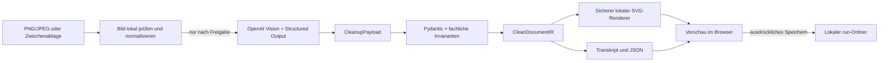

# Notes2StructureAI

> Aus handschriftlichem Gekritzel wird eine präsentable digitale Notiz – ohne den Inhalt in eine
> künstliche Dokumentkategorie zu zwingen.

Notes2StructureAI ist ein lokal ausgeführter, produktnaher AI-Engineering-Prototyp. Die Anwendung
nimmt einen Screenshot oder ein Foto einer handschriftlichen Seite entgegen, erkennt Text und
sichtbare Gestaltungselemente und rekonstruiert daraus eine aufgeräumte SVG-Seite. Inhalt,
Quellsprache, Gruppierung sowie die relative Anordnung von Text, Kästen, Linien und Pfeilen sollen
dabei erhalten bleiben.

Die Anwendung verbindet probabilistische Vision-Erkennung mit einer streng validierten,
deterministischen Verarbeitung. Das Modell liefert keine direkt übernommene Grafik: Es beschreibt
zunächst ein strukturiertes Layout, das lokal geprüft und anschließend von der Anwendung sicher
gerendert wird.

**English summary:** A local-first Python prototype that turns handwritten notes into validated,
clean SVG documents. It combines vision-based extraction with strict structured outputs,
deterministic rendering, explicit uncertainty handling, and user-controlled data transmission.

## Das Problem

Handschriftliche Notizen sind schnell erstellt und im Arbeitsalltag praktisch. Als dauerhaftes
Dokument oder Präsentationsmaterial wirken Screenshots aus OneNote, Whiteboards oder Papier aber
häufig unruhig und schlecht lesbar.

Die erste Projektversion klassifizierte Eingaben als Notiz, Mindmap, Prozess- oder
Architekturdiagramm. Praktische Nutzung zeigte jedoch: Der größere Nutzen liegt nicht in einer
erneuten Interpretation, sondern in einer formatneutralen visuellen Bereinigung. Deshalb wurde das
Produkt auf einen einfacheren Workflow fokussiert:

```text
Bild einfügen → Notiz optimieren → Vorschau prüfen → Ergebnis speichern
```

Diese Entwicklung ist eine bewusste Produktentscheidung: Die Technik folgt dem tatsächlichen
Nutzerproblem, nicht umgekehrt.

## Ergebnis und Funktionsumfang

Das lokale Browser-Frontend bietet:

- PNG- und JPEG-Import per Dateiauswahl, Drag-and-drop oder Zwischenablage,
- wortnahe Erkennung deutscher, englischer und gemischter Handschrift,
- Rekonstruktion von Textblöcken, Kästen, Ellipsen, Linien und Pfeilen,
- eine sofortige SVG-Vorschau ohne zusätzlichen Modellaufruf,
- sichtbare Kennzeichnung unsicher erkannter Inhalte,
- ausdrückliche Freigabe vor jeder externen Bildübertragung,
- Speichern erst nach menschlicher Prüfung.

Ein gespeicherter Lauf enthält:

| Datei | Inhalt |
| --- | --- |
| `optimized-note.svg` | Aufgeräumte, skalierbare Notiz |
| `transcript.md` | Erkannter Inhalt mit Prüfhinweisen |
| `result.json` | Validiertes Layout, Provenienz und Unsicherheiten |

Die bestehende CLI bleibt als zusätzlicher Analysepfad verfügbar. Sie kann Transkripte,
strukturierte Notizen und – bei belastbarer Struktur – Mermaid-Diagramme erzeugen.

## AI-Engineering statt „LLM macht alles“

| Herausforderung | Umsetzung |
| --- | --- |
| Modellantworten sind nicht automatisch vertrauenswürdig | Pydantic-v2-Modelle verbieten zusätzliche Felder und prüfen Koordinaten, IDs, Referenzen und fachliche Invarianten. |
| Vision-Erkennung ist probabilistisch | Unsichere Rekonstruktionen und Alternativen bleiben explizit erhalten; kritische Zahlen oder Eigennamen werden nicht plausibel ergänzt. |
| Modelltext könnte aktive Inhalte einschleusen | Das Modell liefert weder SVG noch HTML. Ein lokaler Renderer escaped Text und erzeugt ausschließlich ein festes, inertes SVG-Subset. |
| Bilder können Prompt-Injection enthalten | Anweisungen im Bild gelten ausschließlich als Dokumentinhalt und werden nicht als Systemanweisungen ausgeführt. |
| Externe Verarbeitung betrifft private Inhalte | Ohne ausdrückliche Checkbox-Freigabe findet kein Remote-Aufruf statt; Metadaten werden vor der Übertragung entfernt. |
| Modellaufrufe kosten Zeit und Geld | Eine Optimierung benötigt im Normalfall genau einen Request. Vorschau und Speichern arbeiten ausschließlich mit dem validierten Ergebnis. |
| Fehler dürfen keine halben Ergebnisse hinterlassen | Artefakte werden zunächst vollständig temporär geschrieben und anschließend atomar als neuer Lauf veröffentlicht. |
| Tests sollen keine API-Kosten erzeugen | Die normale Testsuite verwendet einen deterministischen Fake-Provider und benötigt weder Netzwerk noch API-Schlüssel. |

## Architektur



Die zentrale Grenze liegt zwischen `CleanupPayload` und `CleanDocumentIR`: Erst nach lokaler
Schema- und Integritätsprüfung dürfen Daten an Renderer und Writer weitergegeben werden. Dadurch
bleiben probabilistische Erkennung und deterministische Softwarelogik klar getrennt.

Weitere Details stehen in der [technischen Architektur](docs/architecture.md), der
[Produktspezifikation](docs/spec.md) und dem [Backlog](docs/backlog.md).

## Technologie

- Python 3.12 und `uv`
- OpenAI Responses API mit Bildeingabe und Structured Outputs
- Pydantic v2 für strikte Laufzeitverträge
- Gradio für das ausschließlich lokal gebundene Browser-Frontend
- Pillow für Bildprüfung, Orientierung und Metadatenbereinigung
- pytest mit Fake-Provider für reproduzierbare Offline-Tests
- Ruff, Pyright strict und pre-commit für statische Qualitätssicherung
- GitHub Actions für Windows- und Linux-Prüfungen

## Schnellstart

### Voraussetzungen

- Python 3.12
- [`uv`](https://docs.astral.sh/uv/)
- ein OpenAI-API-Projekt mit geeignetem Modellzugriff und eigenem API-Schlüssel

Die virtuelle Umgebung liegt ausschließlich im Projekt. Eine global installierte Python-Version
wird nicht ersetzt.

```powershell
uv sync --frozen --group dev
Copy-Item .env.example .env
```

Anschließend die Platzhalter in `.env` lokal ausfüllen. Die Datei ist über `.gitignore`
ausgeschlossen und darf nicht committed werden.

### Lokales Frontend

```powershell
uv run notes2structure-ui
```

Die Anwendung öffnet `http://127.0.0.1:7860`. Danach:

1. Bild oder OneNote-Screenshot einfügen.
2. Übertragung für diesen Aufruf ausdrücklich erlauben.
3. **Notiz optimieren** auswählen.
4. Vorschau und markierte Unsicherheiten prüfen.
5. Das Ergebnis bei Gefallen speichern.

Das Frontend bindet nur an die Loopback-Schnittstelle. Öffentliches Sharing,
Framework-Telemetrie und Monitoring-Endpunkte sind deaktiviert.

### Kompatible CLI-Analyse

```powershell
uv run notes2structure analyze "C:\Pfad\zu\notiz.jpg" `
  --env-file .env `
  --allow-remote `
  --output-dir local-data/output
```

Ohne `--allow-remote` wird kein Bild an den externen Provider übertragen. Details zu Modellwahl,
Retries, Datenübertragung und Datenschutzgrenzen dokumentiert die
[Providerentscheidung](docs/provider-openai.md).

## Qualitätsprüfungen

```powershell
uv run ruff check .
uv run ruff format --check .
uv run pyright
uv run pytest
uv run pre-commit run --all-files
```

CI und normale Tests führen keine bezahlten Provideraufrufe aus. Live-Tests bleiben eine bewusst
gestartete, separate Prüfung mit freigegebenen Bildern.

## Bewusste Grenzen

Notes2StructureAI ist ein lokaler MVP und keine öffentlich betriebene SaaS-Plattform.

- Handschrifterkennung kann falsch oder unvollständig sein.
- Die Anwendung erzeugt keine Genauigkeitsgarantie und ersetzt keine menschliche Prüfung.
- Die räumliche Rekonstruktion ist semantisch plausibel, aber nicht pixelgenau.
- Verarbeitet wird jeweils ein statisches Bild; Batch-Verarbeitung und Folder Watching sind nicht
  Teil des MVP.
- Es gibt keine Datenbank, Benutzerverwaltung oder Cloud-Bereitstellung.
- Externe API-Kosten und Datenrichtlinien hängen vom verwendeten OpenAI-Projekt ab.

Diese Grenzen sind bewusst dokumentiert. Der Prototyp demonstriert belastbare
AI-Engineering-Muster, ohne einen nicht belegten Enterprise- oder Produktionsreifegrad zu
behaupten.

## Was das Projekt demonstriert

Notes2StructureAI dient als kompakte Fallstudie für:

- Übersetzung eines unscharfen Nutzerproblems in einen klaren AI-Workflow,
- iterative Produktentwicklung anhand realer Nutzung statt Feature-Spekulation,
- Design und Versionierung strukturierter Modellverträge,
- sichere Integration externer Vision-Modelle,
- deterministische Nachverarbeitung probabilistischer Ergebnisse,
- Datenschutz-, Kosten- und Fehlergrenzen an der Anwendungsschnittstelle,
- testbare Python-Architektur ohne Netzwerkabhängigkeit in der Standardsuite.

## Projektstatus

Der visuelle Cleanup-Workflow ist als lokaler MVP implementiert. Der wichtigste nächste
Qualitätsschritt ist keine zusätzliche Funktion, sondern ein kleiner, ausdrücklich freigegebener
Evaluationsdatensatz mit unterschiedlichen Handschriften und Layouts. Damit lassen sich Änderungen
an Modell, Prompt und Rendering nachvollziehbar vergleichen.

Lizenz: [MIT](LICENSE)
