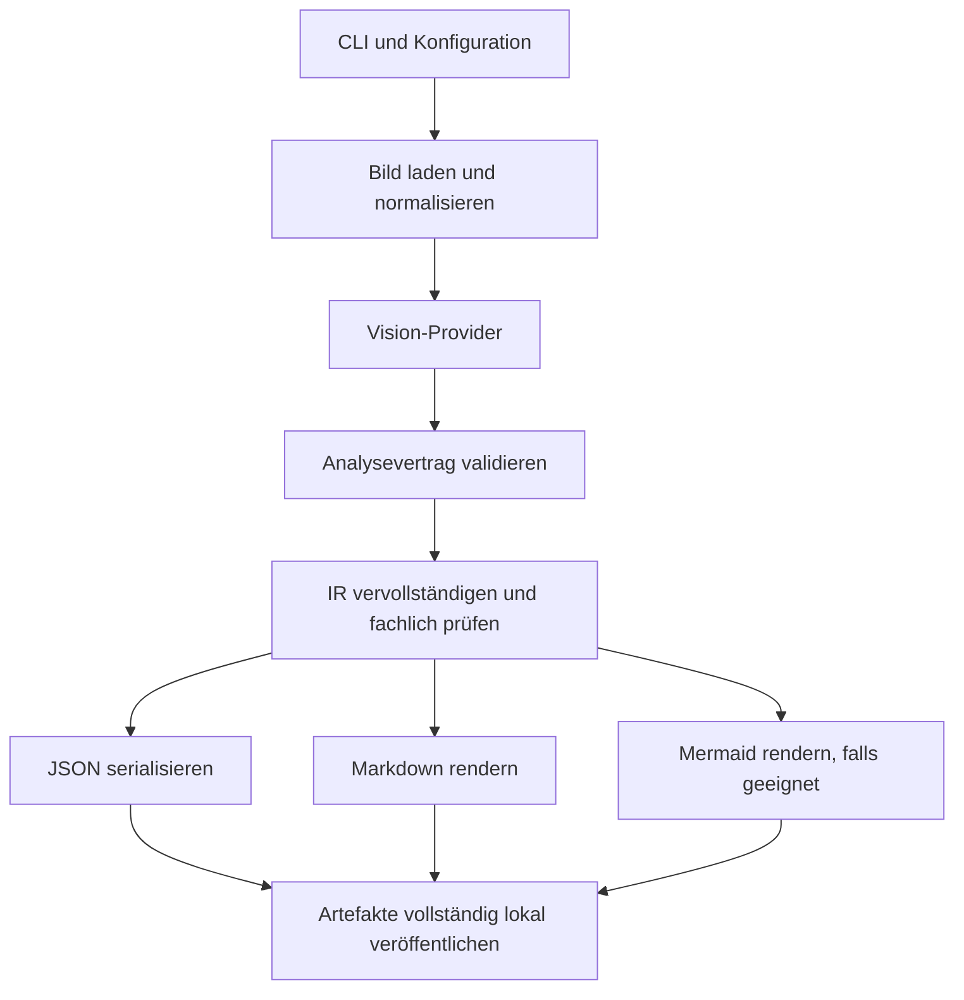

# Notes2StructureAI — Architektur v0.1

Status: Zielarchitektur des MVP. Produktverhalten und Abnahme stehen in [spec.md](spec.md), Arbeitsregeln in [AGENTS.md](../AGENTS.md). Die Architektur verwendet eine synchrone Pipeline mit Pydantic-Modellen und lokalen Dateien. Es gibt weder einen autonomen Agenten noch einen serverseitigen Dienst.

## 1. Entscheidungen

| Entscheidung | Begründung |
| --- | --- |
| Python 3.12, `src/`-Layout, `pyproject.toml`, `uv.lock` | Kleine, reproduzierbare und testbare Anwendung |
| Pydantic v2, Pyright strict, Ruff, pytest | Validierte Laufzeitdaten plus statische und verhaltensbezogene Prüfungen |
| `argparse`, `logging`, `pathlib` aus der Standardbibliothek | Für die kleine CLI genügen vorhandene Werkzeuge |
| Pillow für Bildprüfung und Normalisierung | Formatprüfung, Orientierung, RGB und Metadatenentfernung an einer Stelle |
| Ein Provider-Protocol und ein konkreter Adapter | Austauschbarkeit an der tatsächlich variablen Grenze |
| Eine gemeinsame IR | Transkription, Notizen und Diagramm bleiben aufeinander beziehbar |
| Reine Markdown-/Mermaid-Renderer | Reproduzierbare Ausgabe ohne weitere Modellkosten |
| Mermaid-Flowcharts für alle Diagrammtypen | Kleine, gemeinsame Syntaxfläche mit sicherem Escaping |
| Dateiverzeichnisse statt Datenbank | Ein Dokument pro Lauf benötigt keine Persistenzschicht |

Diese Festlegungen sind Projektentscheidungen, keine Behauptung, dass jede kleine Python-Anwendung genau diese Toolauswahl benötigt. Zusätzliche Abstraktionen entstehen erst aus konkretem Bedarf.

## 2. Komponenten und Datenfluss



1. CLI validiert Optionen, Konfiguration und Remote-Freigabe.
2. Bildleser prüft die ursprüngliche Datei, bildet SHA-256 und normalisiert Bilddaten gemäß Spec. Dateiinhalte für Hash und Analyse stammen aus demselben gelesenen Snapshot.
3. Provider erhält normalisierte Bildbytes, MIME-Typ und Analyseoptionen. Er liest keine Pfade und schreibt keine Dateien.
4. Adapter überführt die Antwort in `AnalysisPayload`; anschließend prüft die Domain strukturelle und fachliche Invarianten.
5. Pipeline ergänzt ausschließlich vertrauenswürdige Laufmetadaten, berechnet effektiven Typ, Diagrammstatus und Prüfstatus und erzeugt `DocumentIR`.
6. Renderer erzeugen alle Inhalte im Speicher. Writer veröffentlicht das vollständige Dateiset in einem neuen Laufverzeichnis.

Klassifikation, Transkription und Struktur werden im Modus `full` möglichst in einer Analyse angefordert. Kein separater Klassifikationsaufruf und kein zweiter LLM-Aufruf zum Rendern. Das strukturelle Extrahieren durch ein Modell bleibt probabilistisch; die nachfolgenden Verarbeitungsschritte sind deterministisch.

## 3. Vorgesehene Repository-Struktur

```text
Notes2StructureAI/
├── AGENTS.md
├── README.md
├── pyproject.toml
├── uv.lock
├── .env.example
├── .gitignore
├── .pre-commit-config.yaml
├── .github/workflows/ci.yml
├── docs/
│   ├── spec.md
│   └── architecture.md
├── src/notes2structure/
│   ├── __init__.py
│   ├── cli.py
│   ├── config.py
│   ├── pipeline.py
│   ├── schemas.py
│   ├── errors.py
│   ├── image_reader.py
│   ├── output_writer.py
│   ├── providers/
│   │   ├── base.py
│   │   └── <chosen_provider>.py
│   ├── prompts/
│   │   └── analyze_v2.md
│   └── renderers/
│       ├── markdown.py
│       └── mermaid.py
└── tests/
    ├── unit/
    ├── integration/
    └── fixtures/
```

Die Struktur ist eine Umsetzungsvorgabe, keine Liste bereits vorhandener Dateien. `<chosen_provider>.py` wird durch den tatsächlichen Adapternamen ersetzt. Ein Fake-Provider gehört nach `tests/`. Prompts als Paketressourcen ausliefern; Tests prüfen ihren Zugriff auch aus dem installierten Paket. Private Eingaben und Ergebnisse liegen standardmäßig außerhalb versionierter Fixtures.

## 4. Abhängigkeitsgrenzen

`schemas.py` kennt nur Typen, Pydantic und reine Validierungslogik. Keine Imports aus Provider, CLI, Writer oder Renderer. `renderers/` darf die Domain importieren. `providers/base.py` definiert die schmale Schnittstelle mit Domain-Eingaben und -Ausgaben. Der konkrete Adapter kapselt SDK, Transport und Anbieterfehler. `pipeline.py` verwendet den Provider-Vertrag, nicht dessen Implementierung. `cli.py` verbindet die konkreten Bausteine.

Vorgesehene Schnittstellen, als typisierte Verträge zu implementieren:

```python
class VisionProvider(Protocol):
    def analyze(
        self, image: NormalizedImage, options: AnalysisOptions
    ) -> AnalysisPayload: ...

def render_transcript(document: DocumentIR) -> str: ...
def render_notes(document: DocumentIR) -> str: ...
def render_mermaid(document: DocumentIR) -> str | None: ...
```

`NormalizedImage` enthält Bytes, MIME-Typ und Abmessungen. `AnalysisOptions` enthält Modus und optionale Typvorgabe. Laufmetadaten wie Quellhash, Dateiname und Zeitstempel werden nicht vom Modell bezogen. Der Pipeline-Einstieg erhält Provider und Konfiguration explizit; ein DI-Framework ist unnötig.

## 5. Intermediate Representation

### 5.1 Modelle und Felder

Schema-Version: String `"1.0"`. Alle unten aufgeführten Felder sind Pflichtfelder; nullable Felder dürfen ausdrücklich `null` enthalten. Leere Sammlungen sind `[]`. Alle Pydantic-Modelle verbieten zusätzliche Felder. Unbekannte Schema-Versionen ablehnen; keine stille Migration.

| Modell | Felder und Typen |
| --- | --- |
| `DocumentIR` | `schema_version: Literal["1.0"]`, `mode: Literal["transcribe", "full"]`, `source: Source`, `analysis: AnalysisMetadata`, `classification: Classification`, `transcript: list[TranscriptSegment]`, `sections: list[NoteSection]`, `graph: Graph`, `uncertainties: list[Uncertainty]`, `warnings: list[str]`, `review_required: bool`, `diagram: DiagramDecision` |
| `Source` | `filename: str` (Basisname), `sha256: str` (64 Hexzeichen), `media_type: Literal["image/png", "image/jpeg"]` (Originalformat), `width: int`, `height: int` (normalisiert, positiv) |
| `AnalysisMetadata` | `provider: str`, `model: str`, `prompt_version: str`, `created_at: str` (RFC 3339, UTC), `run_id: str` (UUID4-Hex) |
| `Classification` | `detected_type: DocumentType | None`, `requested_type: KnownType | None`, `effective_type: DocumentType | None`, `reason: str | None` |
| `TranscriptSegment` | `id: str`, `text: str`, `status: Literal["clear", "uncertain", "unreadable"]` |
| `NoteSection` | `heading: str`, `items: list[NoteItem]` |
| `NoteItem` | `text: str`, `source_ids: list[str]` (Transkript-IDs, nicht leer) |
| `Graph` | `nodes: list[Node]`, `edges: list[Edge]` |
| `Node` | `id: str`, `label: str`, `kind: Literal["topic", "step", "decision", "component", "unknown"]`, `source_ids: list[str]`, `visual_evidence: str | None`, `uncertain: bool` |
| `Edge` | `id: str`, `source: str`, `target: str`, `label: str | None`, `directed: bool`, `source_ids: list[str]`, `visual_evidence: str | None`, `uncertain: bool` |
| `Uncertainty` | `id: str`, `kind: Literal["text", "classification", "structure", "relation"]`, `target_ids: list[str]` (nicht leer), `message: str`, `alternatives: list[str]` |
| `DiagramDecision` | `status: Literal["generated", "omitted", "not_requested"]`, `reason: str | None` |

`KnownType` umfasst `notes`, `mindmap`, `process`, `architecture`; `DocumentType` zusätzlich `unknown`. Im Transkriptionsmodus sind alle Klassifikationsfelder `null`.

`AnalysisPayload` verwendet dieselben fachlichen Teilmodelle, enthält aber ausschließlich `detected_type`, `classification_reason`, `transcript`, `sections`, `graph`, `uncertainties` und `warnings`. Der Adapter liefert keine Laufmetadaten, keinen effektiven Typ und keine berechneten Statusfelder. Die Pipeline baut die endgültige IR daraus auf.

### 5.2 Invarianten

- IDs folgen den Mustern `t[1-9][0-9]*`, `n[1-9][0-9]*`, `e[1-9][0-9]*`, `u[1-9][0-9]*` für Segmente, Knoten, Kanten und Unsicherheiten. Pro Sammlung sind IDs eindeutig. Referenzen werden vollständig validiert.
- `source_ids` verweist ausschließlich auf vorhandene Transkriptsegmente. Kantenendpunkte verweisen auf vorhandene Knoten. Unsicherheitsziele sind Segment-, Knoten- oder Kanten-IDs oder das reservierte Ziel `classification`.
- Jeder Graphknoten und jede Kante hat mindestens eine Textreferenz oder eine nichtleere `visual_evidence`, etwa „sichtbarer Pfeil vom linken zum rechten Kasten“. Das ist ein nachvollziehbarer Modellhinweis, kein unabhängiger Wahrheitsbeweis.
- Unsichere oder unleserliche Segmente und unsichere Graphobjekte besitzen jeweils mindestens einen zugeordneten Unsicherheitseintrag. Aus unsicheren Textsegmenten abgeleitete Graphobjekte müssen ebenfalls `uncertain = true` tragen. Widersprüchliche Antworten ablehnen, nicht still aufwerten.
- Texte und Labels sind nichtleer; leere Erkennung wird durch leere Sammlungen repräsentiert. Unleserliche Segmente enthalten `[unleserlich]`.
- `full`: erkannter und effektiver Typ sowie Klassifikationsbegründung sind nicht-null. Typvorgaben verändern den erkannten Typ nicht.
- `transcribe`: `sections`, Graphsammlungen und klassifikationsbezogene Unsicherheiten sind leer, Klassifikationsfelder null, Diagrammstatus `not_requested` mit Grund null. Unzulässige zusätzliche Analysedaten nicht still ignorieren.
- `full` mit effektivem Typ `notes`/`unknown`: leerer Graph und Diagrammstatus `omitted` mit Grund. Bei einem Diagrammtyp gilt: mindestens ein Knoten → `generated`, sonst `omitted` mit Grund. Kanten ohne Knoten sind ungültig.
- Mindmap-Graphen bilden, wenn nichtleer, einen gerichteten Baum: genau eine Wurzel, je weiterem Knoten genau ein Elternknoten, zusammenhängend und zyklenfrei. Prozess- und Architekturgraphen dürfen Zyklen, isolierte Knoten und ungerichtete Beziehungen enthalten.
- Kein unbelegtes Anpassen eines Graphen, um einen Typ zu erzwingen. Kann der Provider den verlangten Graph nicht sicher bilden, soll er einen leeren Graph mit Warnung liefern. Ein strukturell ungültiger gelieferter Graph bleibt ein Validierungsfehler.
- `review_required` wird ausschließlich nach den Regeln in der Spec berechnet. Renderer übernehmen diesen Wert unverändert.

Ressourcengrenzen zusätzlich zur Antwortgröße: höchstens 1.000 Segmente, 200 Abschnitte mit je 100 Notizpunkten, 500 Knoten, 1.000 Kanten und 1.000 Unsicherheiten. Maximal 10.000 Zeichen je Transkriptsegment/Notizpunkt, 500 je Überschrift/Label und 2.000 je Begründung, Evidenz oder Warnung. Pro Objekt höchstens 1.000 Referenzen, pro Unsicherheit höchstens zehn Alternativen à 2.000 Zeichen, insgesamt höchstens 100 Warnungen. Überschreitungen ablehnen, niemals still abschneiden.

### 5.3 Minimales vollständiges Beispiel

Das Beispiel zeigt eine sichere Textnotiz im Modus `full`. Hash und Modellkennung sind illustrative Werte, keine echten Analyseergebnisse.

```json
{
  "schema_version": "1.0",
  "mode": "full",
  "source": {
    "filename": "notiz.png",
    "sha256": "aaaaaaaaaaaaaaaaaaaaaaaaaaaaaaaaaaaaaaaaaaaaaaaaaaaaaaaaaaaaaaaa",
    "media_type": "image/png",
    "width": 1200,
    "height": 800
  },
  "analysis": {
    "provider": "example-provider",
    "model": "configured-model",
    "prompt_version": "analyze-v1",
    "created_at": "2026-09-17T10:00:00Z",
    "run_id": "123e4567e89b42d3a456426614174000"
  },
  "classification": {
    "detected_type": "notes",
    "requested_type": null,
    "effective_type": "notes",
    "reason": "Eine einzelne Textnotiz ohne sichtbare Beziehungen."
  },
  "transcript": [
    {"id": "t1", "text": "Prototyp testen", "status": "clear"}
  ],
  "sections": [
    {
      "heading": "Notiz",
      "items": [{"text": "Prototyp testen", "source_ids": ["t1"]}]
    }
  ],
  "graph": {"nodes": [], "edges": []},
  "uncertainties": [],
  "warnings": [],
  "review_required": false,
  "diagram": {
    "status": "omitted",
    "reason": "Für den Dokumenttyp notes ist kein Diagramm vorgesehen."
  }
}
```

## 6. Provider und Konfiguration

Der konkrete Adapter verwendet nach Möglichkeit strukturierte Ausgabe mit dem Schema von `AnalysisPayload`. Unabhängig von Anbieterzusagen validiert die Anwendung jede Antwort lokal. SDK-Objekte, Response-Envelopes und transportbezogene Felder bleiben im Adapter. Kein tolerant herausgeschnittenes JSON aus beliebigen Markdown-Fences und keine automatische semantische Reparatur.

Der versionierte Prompt verlangt wortnahe Segmente, belegte Struktur, explizite Unsicherheit und die vereinbarten Felder. Er trennt Anweisungen von Bildinhalt. Dokumenttext kann keine Werkzeuge aktivieren; der Provider hat ausschließlich die Analysefunktion. Modellparameter, soweit unterstützt, konservativ setzen und dokumentieren; geringe Temperatur garantiert keinen Determinismus.

Konfiguration über `N2S_PROVIDER`, `N2S_MODEL` und `N2S_API_KEY`; für einen lokalen Adapter wäre letzterer optional. `.env` kann über `--env-file PATH` ausdrücklich geladen werden, bereits gesetzte Umgebungsvariablen haben Vorrang. CLI-Verarbeitungsoptionen haben Vorrang vor ihren Defaults. Kein automatisches Suchen in übergeordneten Verzeichnissen. Endpoints sind für den konkreten Adapter festgelegt; beliebige Endpoints sind im MVP nicht erforderlich.

Die Konfiguration enthält außerdem die festen MVP-Ressourcenlimits. Größenlimits dürfen nicht unbemerkt durch Anbieter-SDKs aufgeweicht werden. Bei der Adapterwahl dokumentieren: Bild-/Modellunterstützung, Datenübertragung, erforderliche Secrets, Rückgabevertrag, verwendete SDK-Version und tatsächliche Timeoutsteuerung. Die Providerwahl ist die einzige noch offene Implementierungsentscheidung; sie blockiert weder Domain noch Fake-Pipeline und Renderer.

## 7. Rendering und Ausgabe

`result.json` wird aus `DocumentIR` mit fester Feldreihenfolge und Einrückung serialisiert. Markdown nutzt die vorhandene Listenreihenfolge; Mermaid ordnet IDs nach ihrem numerischen Anteil. Kein Renderer erzeugt eigene Zeitstempel oder Zufallswerte.

`transcript.md` enthält Quellbasisname, Modus, Prüfstatus, geordnete Segmente und Unsicherheiten. `notes.md` enthält erkannte/gewünschte/effektive Klassifikation, strukturierte Abschnitte mit Segmentreferenzen, Warnungen, Unsicherheiten und Diagrammstatus. Beide Dateien zeigen, dass eine menschliche Prüfung erforderlich ist, wenn das Flag gesetzt ist.

Mermaid-IDs werden ausschließlich aus validierten Knoten-IDs gebildet. Labels werden in einer zentralen Escape-Funktion für die feste Flowchart-Syntax kodiert: Steuerzeichen normalisieren, Zeilenumbrüche in Leerzeichen umwandeln, Anführungszeichen und syntaktisch aktive Zeichen sicher als Mermaid-Entities ausgeben. Keine ungeprüfte Interpolation. Keine HTML-Labels, Konfigurationsdirektiven, URLs, `click`-Aktionen oder benutzerdefinierte Styles. Eigene Renderer-Templates bestimmen Richtung, Formen und Kanten vollständig. Eine Entscheidung darf als Raute erscheinen; andere Knoten bleiben einfache Boxen.

Diagrammstatus `generated` heißt: Mermaid-Quelltext wird als Teil des vollständigen Ergebnisses ausgegeben. Er bedeutet weder unabhängige semantische Verifikation noch Erzeugung eines Bildes. CI prüft das unterstützte Syntaxsubset mit einem fest versionierten Mermaid-Parser. Der Endnutzer benötigt nur dann eine Mermaid-Anzeige, wenn er `.mmd` visuell öffnen möchte.

Der Writer erhält ein Mapping fester Dateinamen zu Texten. Er erzeugt ein exklusives temporäres Verzeichnis im Ausgabeverzeichnis und veröffentlicht es erst nach vollständigem Schreiben unter `run-<uuid4-hex>`. Ein bestehendes Ziel ist ein Fehler; nie ersetzen. Bei gewöhnlichen Fehlern eigene temporäre Dateien aufräumen. Nach Stromausfall oder Prozessabbruch können temporäre Reste bleiben; kein Anspruch auf transaktionale Dauerhaftigkeit über Hardwareausfälle hinweg.

## 8. Fehlerbehandlung und Beobachtbarkeit

| Fehlerklasse | Beispiele | Verhalten |
| --- | --- | --- |
| `InputError`, `ConfigurationError` | Bild ungültig, Secret fehlt, Remote-Freigabe fehlt | Vor Analyse abbrechen, Exit `2` |
| `ProviderError` | Authentifizierung, Transportfehler, Limit, Timeout | Bereinigte Meldung, Exit `3` |
| `AnalysisValidationError` | JSON ungültig, Schemafehler, falsche Referenzen | Keine Reparaturaufrufe, Exit `4` |
| `RenderingError`, `OutputError` | Rendererfehler, fehlende Schreibrechte | Keine Veröffentlichung, Exit `5` |
| Unerwarteter Fehler | Programmierfehler | Kontrollierter CLI-Abbruch, Exit `1` |

Nur transiente Verbindungsfehler, Timeouts, HTTP 429 und HTTP 5xx wiederholen. Maximal drei Gesamtversuche; Backoff 1 und 2 Sekunden mit kleinem Jitter, `Retry-After` nur innerhalb der verbleibenden Gesamtfrist. Maximal 60 Sekunden pro Versuch und 200 Sekunden insgesamt; Transport muss diese Fristen tatsächlich durchsetzen. SDK-Retries deaktivieren, wenn die eigene Schleife aktiv ist. Authentifizierungs-, Eingabe-, Schema- und sonstige nichttransiente HTTP-Fehler nicht wiederholen. Ein erneut gesendeter Request kann trotz Timeout Kosten beim Anbieter verursachen; kein Exactly-once-Versprechen.

Logs enthalten Ereignisname, Lauf-ID, Verarbeitungsphase, Dauer, Versuchsnummer und bereinigten Fehlercode. Keine Originalpfade oder Inhaltsdaten. ValidationErrors und SDK-Exceptions nicht ungefiltert serialisieren, da sie Eingabewerte oder Secrets enthalten können. Keine zusätzliche Monitoring-Infrastruktur im MVP.

## 9. Verifikation und Umsetzungsschritte

1. **Bootstrap:** Paket, CLI-Hilfe, Pydantic-Modelle, Beispielschema, Ruff/Pyright/pytest, Lockfile, Hooks und CI. Beispiel-JSON aus diesem Dokument als Schema-Fixture prüfen.
2. **Lokale Pipeline:** Bildprüfung und Normalisierung, Fake-Provider, Modi und Fehlerverträge. Noch keine echte Netzwerkverarbeitung.
3. **Artefakte:** Markdown-/Mermaid-Renderer, Escaping, Parser-Fixtures, sichere Veröffentlichung, CLI-End-to-End-Tests.
4. **Vision-Adapter:** Anbieter auswählen, SDK kapseln, versionierten Prompt integrieren, Remote-Freigabe und Retry-Grenzen testen.
5. **MVP-Abnahme:** Alle Acceptance Criteria prüfen, reale Beispiele manuell bewerten, Einrichtung und bekannte Erkennungsgrenzen in README dokumentieren.

Unit-Tests prüfen Invarianten und Rendering unabhängig vom SDK. Integrationstests verwenden einen injizierten Fake und temporäre Verzeichnisse. Live-Tests bleiben ein bewusst gestarteter separater Schritt. CI installiert das gebaute Paket zusätzlich in einer sauberen Umgebung, um Entry-Point und Prompt-Ressourcen zu prüfen.

Spätere Evals erhalten einen kleinen versionierten Datensatz mit freigegebenen Bildern, Referenztranskripten, Dokumenttypen und annotierten Beziehungen. Sinnvolle Dimensionen sind Zeichen-/Wortfehler, kritische Zahlenfehler, Klassifikationsqualität, korrekte Knoten/Kanten und Umgang mit Unleserlichkeit. Modell- und Promptänderungen gegen denselben Datensatz vergleichen; keine bloßen JSON- oder Snapshot-Vergleiche als Qualitätsmessung der Erkennung ausgeben.

## 10. Erweiterungspunkte ohne Vorab-Infrastruktur

- Lokale oder alternative Vision-Anbieter implementieren denselben Provider-Vertrag.
- Batch oder Folder Watcher ruft später denselben Pipeline-Einstieg auf; keine Triggerlogik in der Domain.
- Weitere Renderer lesen dieselbe validierte IR. Neue fachliche Semantik erfordert eine bewusste Schema-Versionierung.
- Ein späterer Korrekturworkflow validiert bearbeitete IR vor erneutem Rendering und erhält Provenienz.
- Eine GUI kann die Pipeline nutzen; sie rechtfertigt heute weder REST-API noch Server.

## 11. Technische Referenzen

Die Modellvalidierung und das Verbot zusätzlicher Felder orientieren sich an der [Pydantic-Dokumentation](https://docs.pydantic.dev/latest/concepts/models/). Strenge statische Prüfungen werden über die [Pyright-Konfiguration](https://github.com/microsoft/pyright/blob/main/docs/configuration.md) festgelegt. Renderer und Escaping müssen gegen die [Mermaid-Flowchart-Syntax](https://mermaid.js.org/syntax/flowchart.html) geprüft werden. Diese Referenzen ergänzen den Projektvertrag; sie ersetzen keine festgelegten Abhängigkeitsversionen und Tests.
